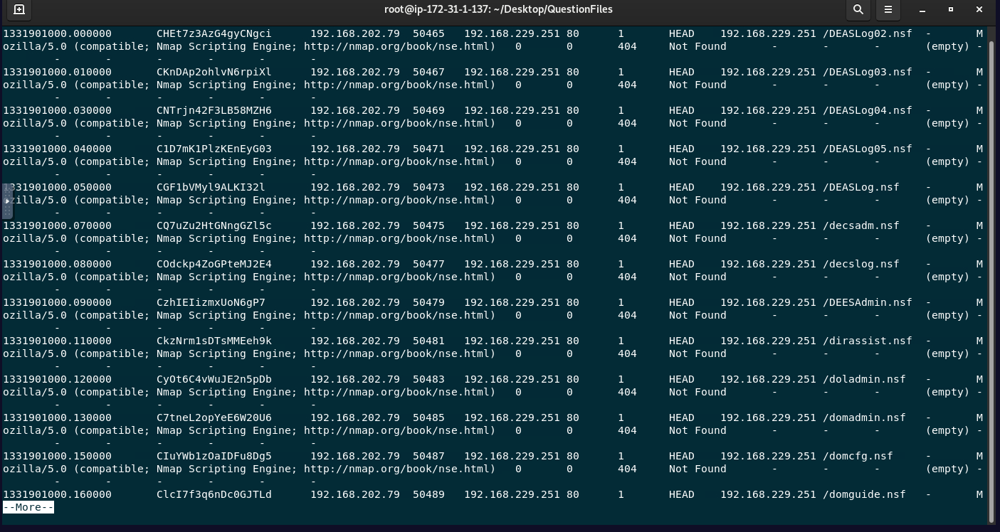

# 🌐 Web Log Analysis

## 📌 Scenario
At the end of the lesson we get to answer four questions. To start, we are given a massive log file. In my case to keep it simple, I use CLI that comes with Ubuntu. 

CLI command:  $ cat http.log | more

Gives us the following: showing us a vast amount of data:

Let's start the triage of this web log to answer the lesson questions:

1) Are there any SQL injection attacks with a status code of 200? (True or False)
   To answer that, we'll use the following command:
   $ cat http.log | egrep -i 'select|union|insert|concat' |grep '200' |grep 'OK' |more

   Cat: allows us to open and see all the content of the given file: http.log
   |: to separate commands and add them up to keep filtering.
   egrep: to extend grep (to use regex to find specific words)
   -i: case insensitive
   Now we filter common SQL keywords
   select: for extracting data
   union: to combine queries while attacking
   insert: intent to write DB
   concat: used to join words in this payload crafting
   200: to know which ones were successful (received OK from server)
   OK: the equivalent of 200, to confirm and don't get partial matches.
   |more: due to the size of the file, we display the results in pages.

   As we get results, the answer is True.
   
2) Identify the highest requesting IP address.
   We are looking to find patterns, so identifyng the most requesting IP will help us to find. We''l focus      on the third column of the log. The command to use is:

   $cat http.log | awk '{print $3}' |sort -n |uniq -c | sort -n

   awk: process the log by columns, which are separated by spaces.
   print: to show
   $3: third column field of every line of the log. The IPs
   sort -n: as we know, they are numbers, we sort numerically.
   uniq -c: count repetitive lines, as we sorted before, it works.
   sort -n: sorts the results again, numerically.

   As a result, we find out that 192.168.203.63, with more than a million hits, is the top talker,     potential attacker or host.
   
   
  4) How many web requests are made with the "DELETE" method in total?
   Once again, we need to know how many of these have a DELETE method. Knowing the methods are in the 8th       column, we use the following:

   $cat http.log | awk '{print $8}' | grep -w DELETE | wc -l

   grep: to keep filtering
   -w: the whole word, not partial responses
   DELETE: the word to filter
   wc: word count
   -l: lines

   Using this, we reach the number 223, the number of web requests using the DELETE method. And as we            learned, this is a high risk method (delete resources, accounts, data) and also shows us that this is a       possible automated attack.
    
  4) And lastly: Are there web logs with “Nmap Scripting Engine” in the user-agent information among the web     requests made? (True or False)
     To answer this, we execute a grep command, using the provided keywords to check if theres evidence of         this threat.

     $ cat http.log |grep "Nmap Scripting Engine" | more

     The idea is to check if NMAP was used; in the logs, we can find this in the User Agent log information.       And as we get results, the answer is True. If we see multiple entries, we can be witnessing an active reconnaissance, scanning, or we are about to be attacked.

Conclusions:
In this lesson, I learned to use different commands to:
-detect exploitation
-find patterns
-measure risky behaviour
-and detect an active reconnaissance

     
Extra: We can turn this lesson into a SIEM Playbook:
1. Recon of Nmap or scanners.
2. Enumeration of 404
3. Exploitation of SQL keywords
4. Impact: the use of Delete actions

Now, using AI, I translated my CLI commands to a chosen SIEM, in this case, Splunk!

1) index=web sourcetype=http_logs
(user_agent="*nmap*" OR user_agent="*sqlmap*" OR user_agent="*nikto*")
| stats count by src_ip, user_agent

2) index=web sourcetype=http_logs
status=404
| stats count by src_ip
| where count > 100

3) index=web sourcetype=http_logs
("union select" OR "concat(" OR "information_schema")
| stats count by src_ip, uri
| where count > 5

4) index=web sourcetype=http_logs
method IN (DELETE, PUT)
| stats count by src_ip
| where count > 10

End of Lesson
